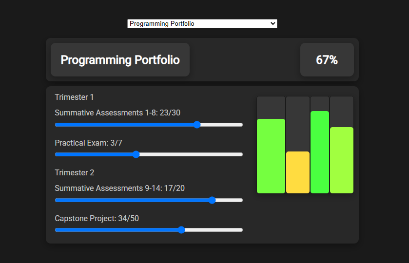

# [grade-calculator](https://eeoooue.github.io/grade-calculator/)
 
A module grade calculator for my course at university.

## Screenshot

## Usage

Project is served by GitHub pages at https://eeoooue.github.io/grade-calculator/

## Technologies

